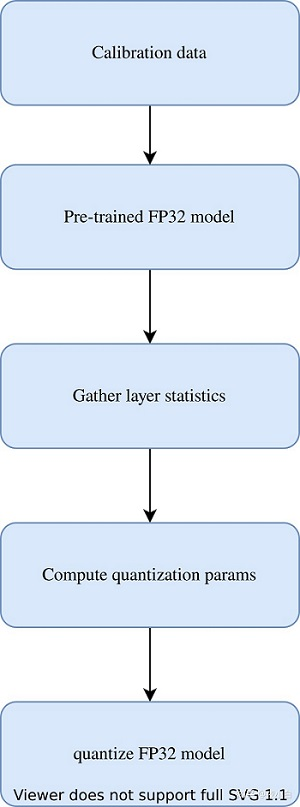
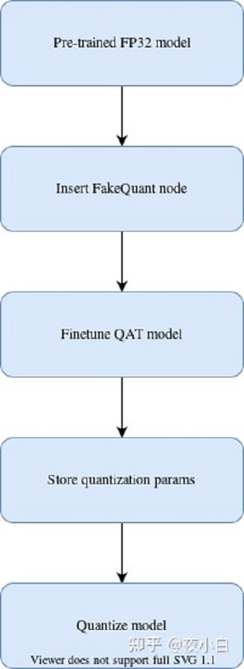
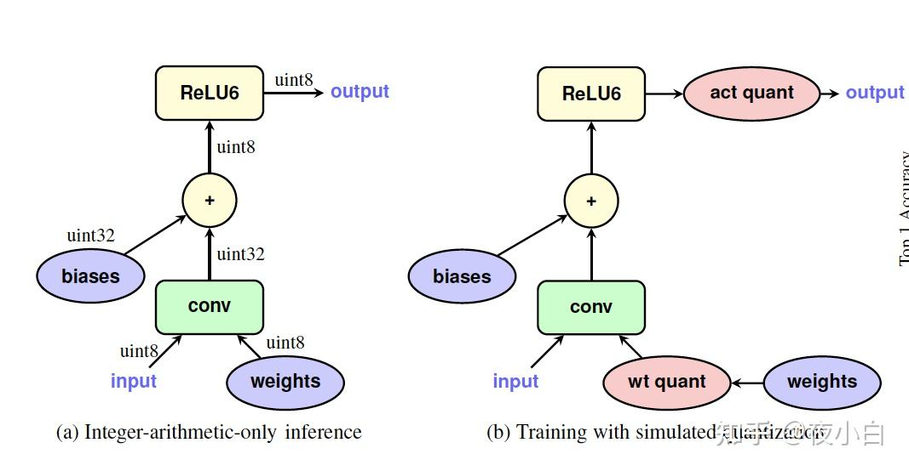

# 量化中的QAT和PTQ

## 1. 量化

量化（quantization）是模型压缩的一种常用方法，通常情况下可以使用不同的量化策略，==将深度学习模型参数与运算的精度从浮点数（FP32）降低至较低的精度==，如INT8，==一方面可以提升模型在cpu/gpu等硬件的推理计算效率，减少计算成本，另一方面能够减小模型的size，在边缘设备具有存储优势。==

量化是一个信息有损压缩的过程，如果训练过程中使用FP32，在模型推理时使用Post-training Quantization（PTQ）直接量化为INT8模型，模型精度会存在一定损失。而量化感知训练（Quantization-aware-training, QAT）在模型训练过程中就引入了**伪量化（Fake-quantization）**来模拟量化过程中带来的误差，通过这种方式能够进一步减少量化后模型的精度损失。

### PTQ vs QAT

| PTQ                                                   | QAT                                                          |
| ----------------------------------------------------- | ------------------------------------------------------------ |
| 不需要重新训练模型                                    | 需要重新训练模型                                             |
| 训练与量化过程没有联系， 通常难以保证量化后模型的精度 | 由于量化参数是通过finetune过程学习得到，通常能够保证精度损失较小 |

### 量化的主要流程如下：

（1）统计出网络某一层的最大值与最小值：
$$
x_{float}\epsilon [x_{float}^{max},x_{float}^{min}]
$$
（2）计算缩放因子scale与零点zero_point

$$
x_{scale}=\frac{x_{float}^{max}-x_{float}^{min}}{x_{quantized}^{max}-x_{quantized}^{min}}
$$

$$
x_{zeropoint}=x_{quantized}^{max}-\frac{x_{float}^{max}}{x_{scale}}
$$

（3）通过以下公式计算出任意float32量化后的int8结果
$$
x_{quantized}={\frac{x_{float}}{x_{scale}}}+x_{zeropoint}
$$
由公式可以看出量化中的精度损失不可避免的，当浮点数的分布均匀时，精度损失较小。但当浮点数分布不均匀时，按照最大最小值映射，则实际有效的int8动态范围就更小了，精度损失变大。

## 2. PTQ

Post-training-quantization（PTQ）是目前常用的模型量化方法之一。以INT8量化为例，PTQ处理流程为

1. 首先在数据集上以FP32精度进行模型训练，得到训练好的baseline模型；
2. 使用小部分数据对FP32 baseline模型进行calibration，这一步主要是得到网络各层weights以及activation的数据分布特性（比如统计最大最小值）；
3. 根据2. 中的数据分布特性，计算出网络各层 缩放因子scale与零点zero_point 量化参数；
4. 使用3. 中的量化参数对FP32 baseline进行量化得到INT8模型，并将其部署至推理框架进行推理；

PTQ方式会使用小部分数据集来估计网络各层weights和activation的数据分布，找到合适的Scale和Zero-Point，从而一定程度上降低模型精度损失。然而，论文中指出PTQ方式虽然在大模型上效果较好（e.g. ResNet101），但是在小模型上经常会有较大的精度损失（e.g. MobileNet） **不同通道的输出范围相差可能会非常大（大于100x）***。* 对异常值敏感。

## 3. 量化感知训练 (Quant Aware Training, QAT)

从上一小节可以看出如果PTQ中模型训练和量化是分开的，而QAT则是在模型训练时加入了**伪量化**节点，用于模拟模型量化时引起的误差。以INT8量化为例，QAT处理流程为：

1. 首先在数据集上以FP32精度进行模型训练，得到训练好的baseline模型；
2. 在baseline模型中插入**伪量化**节点，得到QAT模型，并且在数据集上对QAT模型进行finetune；
3. **伪量化**节点会模拟推理时的量化过程并且保存finetune过程中计算得到的量化参数；
4. finetune完成后，使用3. 中得到的量化参数对QAT模型进行量化得到INT8模型，并部署至推理框架中进行推理

QAT方式需要重新对插入节点之后的模型进行finetune，通过伪量化操作，可以是网络各层的weights和activation输出分布更加均匀，相对于PTQ可以获得更高的精度。

### 3.1  伪量化节点(Fake-quantize)

伪量化实际上是quantization+dequantization的结合，实际上就是模拟量化round引起的误差。伪量化的操作看起来输入输出没变，但是实际上在其中模拟了量化round操作，将这种误差当做一种训练的噪声，在QAT finetune的同时，模型会去适应这种噪声，从而在最后量化为INT8时，减少精度的损失。

$$
\begin{aligned} clamp(r;a,b) &= \min(\max(x,a),b)  \\   s(a,b,n)  &= {\frac{b-a}{n-1}} \\   q(r;a,b,n) &= \lfloor \frac{clamp(r;a,b)-a}{s(a,b,n)} \rceil s(a,b,n) + a  \end{aligned}
$$

伪量化节点插入位置就是需要进行量化操作的位置，论文中在weights输入conv之前（weight quantization）以及activation之后(activation quantizaion)插入了伪量化节点，QAT训练时所有计算都使用FP32单精度。

### 3.2 QAT finetune过程量化参数处理

前面提到伪量化节点会保存finetune过程中的量化参数，伪量化节点的计算公式中 $[a;b]$ 即为FP32浮点数值的范围，这个值将会在finetune过程中进行估计与更新，上面介绍了伪量化节点分别weight quantization以及activation quantizaion：

- 对于weight quantization的量化节点，直接将 $[a;b]$设置为weights的最大值与最小值即可,即$a=\min w$ ， $b=\max w$；
- 对于activation quantizaion，处理方式类似于batch norm，使用了指数移动平均，在finetune的每个batch动态地更新$[a;b]$ ；

最后量化模型的时候，只需设置 $S = s(a,b,n)$ 、$Z = z(a,b,n)$ 即可。

## 链接

[Quantization and Training of Neural Networks for Efficient Integer-Arithmetic-Only Inference](https://arxiv.org/pdf/1712.05877.pdf)

[量化感知训练（Quantization-aware-training）探索-从原理到实践](https://zhuanlan.zhihu.com/p/548174416)

https://leimao.github.io/article/Neural-Networks-Quantization/#Quantization

