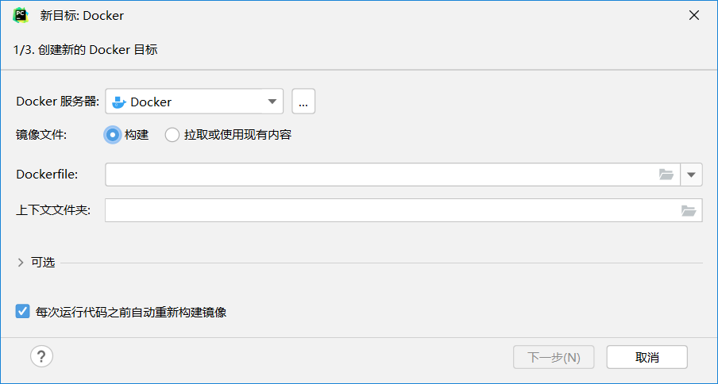
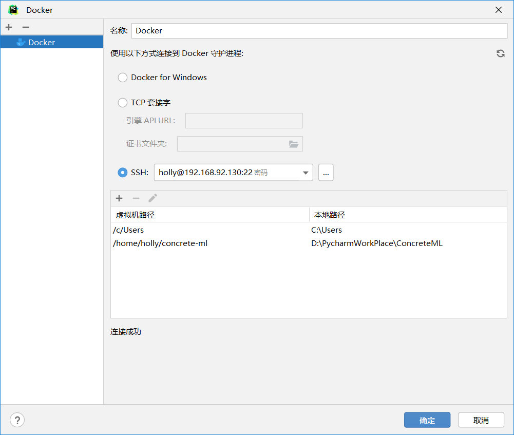
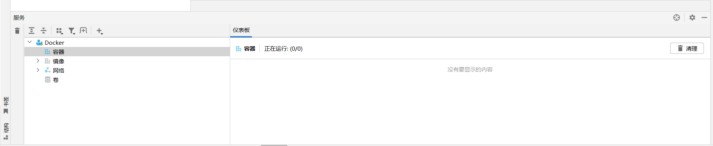
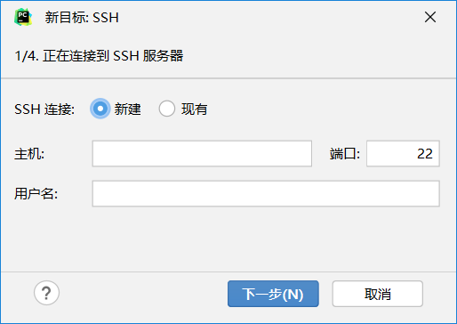
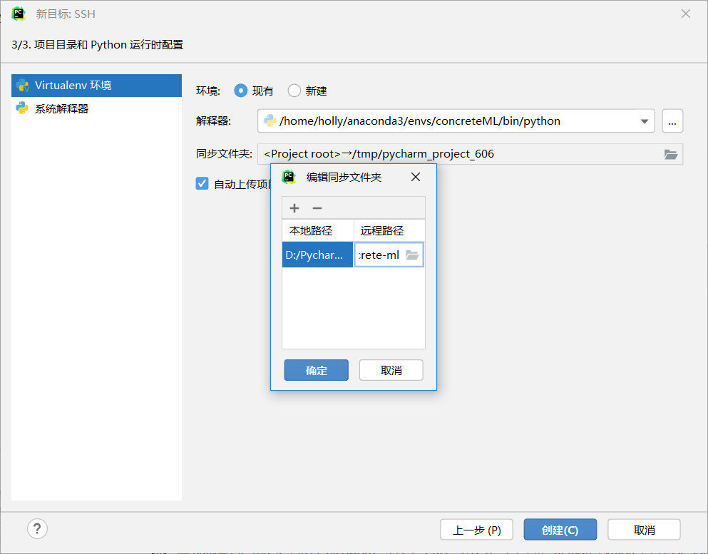
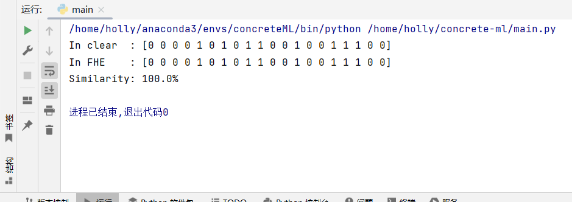

# Concrete ML安装和配置

## 1. 使用Docker

```bash
docker pull zamafhe/concrete-ml:latest
```

### 1.1  启动容器

```bash
# Without local volume:
docker run --rm -it -p 8888:8888 zamafhe/concrete-ml

# With local volume to save notebooks on host:
docker run --rm -it -p 8888:8888 -v /host/path:/data zamafhe/concrete-ml
docker run --rm -it zamafhe/concrete-ml /bin/bash
```

### 1.2  Pycharm使用SSH远程连接虚拟机docker环境


<br>
<br>


**在虚拟机端启动docker容器就可以在Pycharm右下角的服务中看到正在运行的容器了**



### 1.3  Pycharm使用本地Docker

与SSH配置大致相同，但会遇见下面的问题

```bash
Failed to deploy 'nostalgic_var 镜像 ID: zamafhe/concrete-ml': Cannot invoke "ja.util.Map.entrySet()" because the return value of "com.github.dockerjava.core.DockerConfigFile.getAuths()" is null
```

原因:是由于Docker配置文件中的身份验证信息引起的问题。解决此问题的方法是确保您的Docker配置文件中包含正确的身份验证信息。您可以按照以下步骤检查和更新Docker配置文件：

使用以下命令编辑配置文件：

```bash
code "%USERPROFILE%/.docker/config.json"
```

发现`auths`部分为空或缺失，可以手动添加身份验证信息。确保键名是镜像仓库的URL，并将`auth`字段设置为正确编码的凭据。例如，对于Docker Hub，可以添加以下条目：

```json
"auths": {
    "https://index.docker.io/v1/": {
        "auth": "base64编码的身份验证信息"
    }
}
```

base64编码的身份验证信息获取，打开powershell

```powershell
[Convert]::ToBase64String([Text.Encoding]::UTF8.GetBytes('HollyLiang:lhl@123456'))
>>
SG9sbHlMaWFuZzpsaGxAMTIzNDU2
```


配置文件最终更改结果
```json
{
"auths": {
    "https://es6t8c1c.mirror.aliyuncs.com": {       //这个是阿里云镜像的地址
    "auth": "SG9sbHlMaWFuZzpsaGxAMTIzNDU2"
    }
  },
  "credsStore": "desktop",
  "plugins": {
    "-x-cli-hints": {
      "enabled": "true"
    }
  }
}
```


## 2. 使用Ananconda

### 2.1 配置conda环境

安装Anaconda

https://mirrors.tuna.tsinghua.edu.cn/anaconda/archive/

创建虚拟环境

```bash
conda create -n concreteML python=3.9
```

激活环境

```bash
conda activate concreteML
```

安装concreteML

```bash
pip install -U pip wheel setuptools
pip install concrete-ml
```

> 遇见报错：
>
> ```bash
> RuntimeError: Can't emit artifacts: Command failed:ld --shared -o /tmp/tmpawcz2ebs/sharedlib.so /tmp/tmpawcz2ebs.module-0.mlir.o /home/holly/anaconda3/envs/test2/lib/python3.8/site-packages/concrete_python.libs/libConcretelangRuntime-7f1ae15c.so -rpath=/home/holly/anaconda3/envs/test2/lib/python3.8/site-packages/concrete_python.libs --disable-new-dtags 2>&1
> Code:32512
> sh: 1: ld: not found
> 
> ```
> 原因：
>
> 没有安装GCC，执行
>
> ```bash
> sudo apt-get install gcc
> ```
>

### 2.2 Pycharm使用SSH远程连接虚拟机conda环境



**设置好同步文件夹**




## 3. 测试用例

```python
from sklearn.datasets import make_classification
from sklearn.model_selection import train_test_split
from concrete.ml.sklearn import LogisticRegression

# Lets create a synthetic data-set
x, y = make_classification(n_samples=100, class_sep=2, n_features=30, random_state=42)

# Split the data-set into a train and test set
X_train, X_test, y_train, y_test = train_test_split(
    x, y, test_size=0.2, random_state=42
)

# Now we train in the clear and quantize the weights
model = LogisticRegression(n_bits=8)
model.fit(X_train, y_train)

# We can simulate the predictions in the clear
y_pred_clear = model.predict(X_test)

# We then compile on a representative set
model.compile(X_train)

# Finally we run the inference on encrypted inputs
y_pred_fhe = model.predict(X_test, fhe="execute")

print(f"In clear  : {y_pred_clear}")
print(f"In FHE    : {y_pred_fhe}")
print(f"Similarity: {(y_pred_fhe == y_pred_clear).mean():.1%}")

# Output:
    # In clear  : [0 0 0 0 1 0 1 0 1 1 0 0 1 0 0 1 1 1 0 0]
    # In FHE    : [0 0 0 0 1 0 1 0 1 1 0 0 1 0 0 1 1 1 0 0]
    # Similarity: 100.0%
```

**运算结果**


