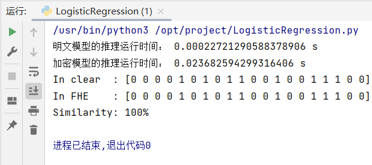

# Concrete-ml支持的操作

## Table lookup

During the Bootstrap operation, in TFHE, you could perform a table lookup simultaneously to reduce noise, turning the Bootstrap operation into a Programmable Bootstrap (PBS).

Let's take a simple example. A function (or circuit) that takes a 4 bits input variable and output the maximum value between a clear constant and the encrypted input:

example:

```python
import numpy as np

def encrypted_max(x: uint4):
    return np.maximum(5, x)
```

could be turned into a table lookup:

```python
def encrypted_max(x: uint4):
    lut = [5, 5, 5, 5, 5, 5, 6, 7, 8, 9, 10, 11, 12, 13, 14, 15]
    return lut[x]
```

The Lookup table `lut` being applied during the Programmable Bootstrap.

## Concrete demo

```python
#Importing the library
from concrete import fhe 

#Defining the function to compile
def add(x, y): 
    return x + y

#Creating a compiler,specifying the function to compile and the encryption status of its inputs:
compiler = fhe.Compiler(add, {"x": "encrypted", "y": "clear"}) 

#An inputset is a collection representing the typical inputs to the function. It is used to determine the bit widths and shapes of the variables within the function.
inputset = [(2, 3), (0, 0), (1, 6), (7, 7), (7, 1)]

#Compiling the function
circuit = compiler.compile(inputset)

x = 4
y = 4

clear_evaluation = add(x, y)

#Performing homomorphic evaluation
#circuit.encrypt_run_decrypt(*args) is just a convenient way to do everything at once.
#It is implemented as circuit.decrypt(circuit.run(circuit.encrypt(*args))).
homomorphic_evaluation = circuit.encrypt_run_decrypt(x, y)

print(x, "+", y, "=", clear_evaluation, "=", homomorphic_evaluation)
```


## 推理时间比较

```python
from sklearn.datasets import make_classification
from sklearn.model_selection import train_test_split
from concrete.ml.sklearn import LogisticRegression
import time

# Lets create a synthetic data-set
x, y = make_classification(n_samples=100, class_sep=2, n_features=30, random_state=42)

# Split the data-set into a train and test set
X_train, X_test, y_train, y_test = train_test_split(
    x, y, test_size=0.2, random_state=42
)

# Now we train in the clear and quantize the weights
model = LogisticRegression(n_bits=8)
model.fit(X_train, y_train)

#计算明文模型的推理运行时间
time_start = time.time()
# We can simulate the predictions in the clear
y_pred_clear = model.predict(X_test)
time_end = time.time()
print('明文模型的推理运行时间：',time_end-time_start,'s')

# We then compile on a representative set 
model.compile(X_train)

# 计算加密模型的推理运行时间
time_start = time.time()
# Finally we run the inference on encrypted inputs !
y_pred_fhe = model.predict(X_test, fhe="execute")
time_end = time.time()
print('加密模型的推理运行时间：',time_end-time_start,'s')

print("In clear  :", y_pred_clear)
print("In FHE    :", y_pred_fhe)
print(f"Similarity: {int((y_pred_fhe == y_pred_clear).mean()*100)}%")
```

**运行结果**




## 链接

[Concrete支持的Python和NumPy操作](https://docs.zama.ai/concrete/getting-started/compatibility)

[Concrete支持的拓展操作](https://docs.zama.ai/concrete/tutorials/extensions)

[Concrete-ml支持的Torch操作](https://docs.zama.ai/concrete-ml/deep-learning/torch_support)